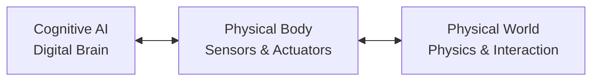

# Physical AI & Humanoid Robotics

Welcome to the comprehensive textbook for the **Physical AI & Humanoid Robotics** course. This textbook is designed to bridge the gap between the digital brain (cognitive AI) and the physical body (robotics actuation). 

Here, students will learn to apply cutting-edge generative AI, reinforcement learning, and advanced computer vision to control humanoid robots in both simulated environments and the physical world.

---

## 1. Why Physical AI Matters

For decades, AI has been confined to the digital realm—processing text, images, and code. While large language models (LLMs) display incredible cognitive capabilities, they lack a physical presence. They cannot feel gravity, manipulate objects, or navigate spatial environments.

**Physical AI (Embodied Intelligence)** is the transition of AI from digital environments into physical space. 

### The Humanoid Advantage
Humanoid robots are poised to excel in our world because:
* **Human-Centered Infrastructure:** Our homes, factories, hospitals, and cities are designed specifically for the human body shape. A humanoid robot can climb stairs, turn doorknobs, and use tools without needing the environment to be restructured.
* **Abundant Training Data:** Humanoids can be trained by observing humans (Imitation Learning) or using abundant human video datasets to learn motor skills, locomotion, and interaction patterns.

---

## 2. Learning Outcomes

By the end of this course, you will be able to:
* **Deconstruct** the principles of Physical AI and Embodied Intelligence.
* **Master** ROS 2 (Robot Operating System) middleware for robust robotic communication and control.
* **Simulate** complex robots and environments using Gazebo, NVIDIA Isaac Sim, and Unity.
* **Develop** high-fidelity perception pipelines using Isaac ROS and hardware-accelerated VSLAM.
* **Design and train** humanoid robots for stable balance, dynamic walking, and precise manipulation.
* **Integrate** Generative AI and multi-modal models for conversational robotics and voice-command execution.

---

## 3. Weekly Breakdown

| Weeks | Topic | Description |
|---|---|---|
| **Weeks 1-2** | Introduction to Physical AI | Foundations of Embodied Intelligence, sensor systems (LiDAR, RGB-D, IMUs), and physics. |
| **Weeks 3-5** | ROS 2 Fundamentals | ROS 2 architecture, nodes, topics, services, actions, custom packages, and Python (`rclpy`) interfaces. |
| **Weeks 6-7** | Robot Simulation (Gazebo) | Setting up physics environments, URDF/SDF files, and simulating sensors in Gazebo and Unity. |
| **Weeks 8-10** | NVIDIA Isaac Platform | Photorealistic simulation in Isaac Sim, Isaac ROS VSLAM, and Sim-to-Real reinforcement learning. |
| **Weeks 11-12**| Humanoid Robot Development | Kinematics, dynamics, bipedal balance control, and humanoid hand manipulation. |
| **Week 13** | Conversational Robotics | Multi-modal VLA models, Whisper voice command systems, and cognitive task planning. |

---

## 4. Course Assessments

* **Project 1:** Custom ROS 2 Package Development in Python
* **Project 2:** Realistic Gazebo Robot Simulation with Sensor feedback
* **Project 3:** Isaac ROS VSLAM Perception and Path Navigation Pipeline
* **Capstone Project:** The Autonomous Humanoid (Simulated robot receives a voice command, plans a route, avoids obstacles, detects a target object, and manipulates it).
