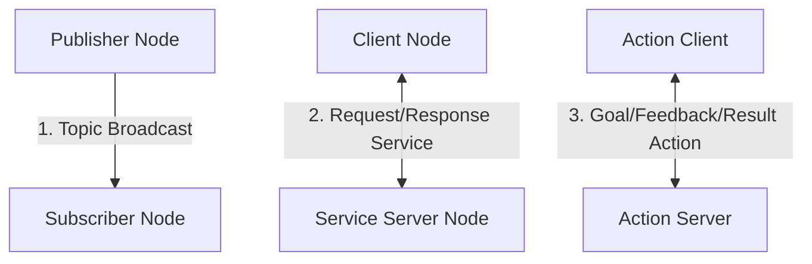

# Module 1: The Robotic Nervous System (ROS 2)

The Robot Operating System (ROS 2) serves as the software middleware or the "robotic nervous system." It enables different components (sensors, cognitive agents, motor controllers) to communicate asynchronously and reliably.

---

## 1. Core ROS 2 Communication Patterns

In ROS 2, robots are controlled by a collection of independent software modules called **Nodes**. These nodes communicate with each other using three primary paradigms:



1. **Topics (Publish/Subscribe):** Continuous data streams (e.g., camera feeds, sensor telemetry, motor states). It is a one-to-many communication pattern.
2. **Services (Request/Response):** Synchronous operations where a client makes a request and waits for a response (e.g., toggling a camera power state, requesting configuration).
3. **Actions (Goal/Feedback/Result):** Asynchronous long-running tasks where feedback is continuously returned (e.g., navigating to a room, lifting a heavy arm).

---

## 2. Bridging Python Agents using `rclpy`

To connect modern AI agents (like LLMs or computer vision models) to the robot actuators, we write ROS 2 nodes using Python's `rclpy` library.

Below is an example of a simple Python-based ROS 2 node that subscribes to voice commands and publishes corresponding velocity vectors:

```python
import rclpy
from rclpy.node import Node
from std_msgs.msg import String
from geometry_msgs.msg import Twist

class VoiceCommanderNode(Node):
    def __init__(self):
        super().__init__('voice_commander')
        
        # Subscribe to speech text commands
        self.subscription = self.create_subscription(
            String,
            '/speech_commands',
            self.listener_callback,
            10)
            
        # Publisher to control robot movement
        self.publisher_ = self.create_publisher(
            Twist, 
            '/cmd_vel', 
            10)
            
        self.get_logger().info('Voice Commander Node has been initialized.')

    def listener_callback(self, msg):
        command = msg.data.lower()
        self.get_logger().info(f'Received Voice Command: "{command}"')
        
        twist_msg = Twist()
        
        # Parse command and map to movement vectors
        if "walk forward" in command:
            twist_msg.linear.x = 0.5  # Move forward at 0.5 m/s
        elif "stop" in command:
            twist_msg.linear.x = 0.0  # Stop
        elif "turn left" in command:
            twist_msg.angular.z = 0.3  # Turn left
            
        self.publisher_.publish(twist_msg)

def main(args=None):
    rclpy.init(args=args)
    node = VoiceCommanderNode()
    try:
        rclpy.spin(node)
    except KeyboardInterrupt:
        pass
    finally:
        node.destroy_node()
        rclpy.shutdown()

if __name__ == '__main__':
    main()
```

---

## 3. URDF: Describing Humanoid Robot Structure

To simulate a humanoid robot, we must describe its physical properties (visuals, collision zones, mass, and joints) using the **URDF (Unified Robot Description Format)**.

A URDF model is structured around two key elements:
* **Links:** The rigid bodies or parts of the robot (e.g., torso, head, left thigh, right foot).
* **Joints:** The connections between links that allow movement (e.g., knee hinge, hip socket).

```xml
<robot name="humanoid_leg_link">
  <!-- Link representing the Lower Leg -->
  <link name="lower_leg">
    <inertial>
      <mass value="2.5"/>
      <origin xyz="0 0 -0.2"/>
      <inertia ixx="0.01" ixy="0.0" ixz="0.0" iyy="0.01" iyz="0.0" izz="0.002"/>
    </inertial>
    <visual>
      <geometry>
        <cylinder radius="0.05" length="0.4"/>
      </geometry>
      <material name="grey">
        <color rgba="0.5 0.5 0.5 1"/>
      </material>
    </visual>
    <collision>
      <geometry>
        <cylinder radius="0.05" length="0.4"/>
      </geometry>
    </collision>
  </link>

  <!-- Joint representing the Knee Hinge -->
  <joint name="knee_joint" type="revolute">
    <parent link="thigh"/>
    <child link="lower_leg"/>
    <origin xyz="0 0 -0.4"/>
    <axis xyz="0 1 0"/>
    <limit lower="-1.57" upper="0.0" effort="50.0" velocity="10.0"/>
  </joint>
</robot>
```

---

## 4. Weekly Breakdown (Weeks 3-5)
* **Week 3:** ROS 2 Architecture, workspace creation, colcon compilation, and environment sourcing.
* **Week 4:** Writing nodes, topics publishers/subscribers, services, and actions in Python.
* **Week 5:** Writing URDF structural files, launching robot state publishers, and visualizing models in RViz.
