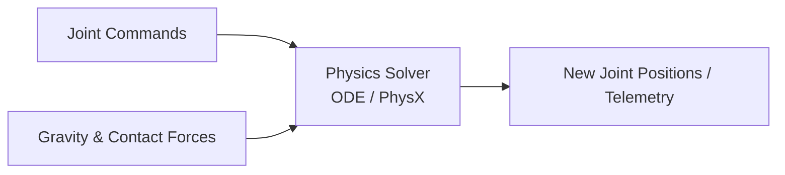

# Module 2: The Digital Twin (Gazebo & Unity)

Before deploying algorithms onto physical hardware, we build a **Digital Twin**—a high-fidelity virtual representation of our robot operating inside a simulated world. This allows developers to test control loops, safety triggers, and AI models safely without damaging expensive components.

---

## 1. Physics Engines & Rigid Body Dynamics

A simulation environment must mimic real-world physics. In **Gazebo** (using the Open Dynamics Engine - ODE), we model:
* **Gravity:** Active downward force (usually $-9.81 m/s^2$ along the Z-axis) affecting all links.
* **Mass & Inertia:** Defining how easy or hard it is to accelerate a robot's limb. An incorrect inertia matrix will cause a humanoid leg to shake uncontrollably or fall over.
* **Frictional Coefficients ($\mu$):** Simulating grip between the robot's feet and the ground. Without friction simulation, bipedal walking is impossible as the feet slide indefinitely.

---

## 2. Sensor Simulation

Robots observe their virtual environments using simulated sensors. In Gazebo and Unity, these are implemented via plugin configurations that publish standard ROS 2 messages.

### A. LiDAR (Light Detection and Ranging)
Generates a 3D point cloud or 2D laser scan by casting virtual rays and measuring return distances.
* **ROS 2 Message type:** `sensor_msgs/msg/LaserScan` or `sensor_msgs/msg/PointCloud2`

### B. Depth Cameras (RGB-D)
Simulates stereo or structured light cameras (like the Intel RealSense) to export synchronized color frames and pixel-level depth grids.
* **ROS 2 Message type:** `sensor_msgs/msg/Image` (for RGB) and `sensor_msgs/msg/PointCloud2` (for 3D spatial points).

### C. IMUs (Inertial Measurement Units)
Tracks acceleration and angular velocity, crucial for bipedal balance algorithms.
* **ROS 2 Message type:** `sensor_msgs/msg/Imu`

---

## 3. High-Fidelity Rendering: The Unity Bridge

While Gazebo is outstanding for raw physics, **Unity** or **NVIDIA Omniverse** is used for high-fidelity rendering, synthetic visual data generation, and complex human-robot interaction simulations.

Using the **ROS2-Unity Integration**, a roboticist can:
1. Run the heavy physics solver in Linux.
2. Publish joint angles to Unity.
3. Unity renders photorealistic environments with lighting, shadows, and human avatars.
4. Unity's virtual camera sensor feeds realistic images back into the AI visual perception model.

---

## 4. Weekly Breakdown (Weeks 6-7)

* **Week 6 (Simulation Environments):** Installing Gazebo, creating customized worlds, adding collision objects, and tweaking friction parameters.
* **Week 7 (Robot Descriptions & SDF):** Converting URDF to SDF (Simulation Description Format), configuring ROS 2 control plugins, and establishing the Unity visualization bridge.
