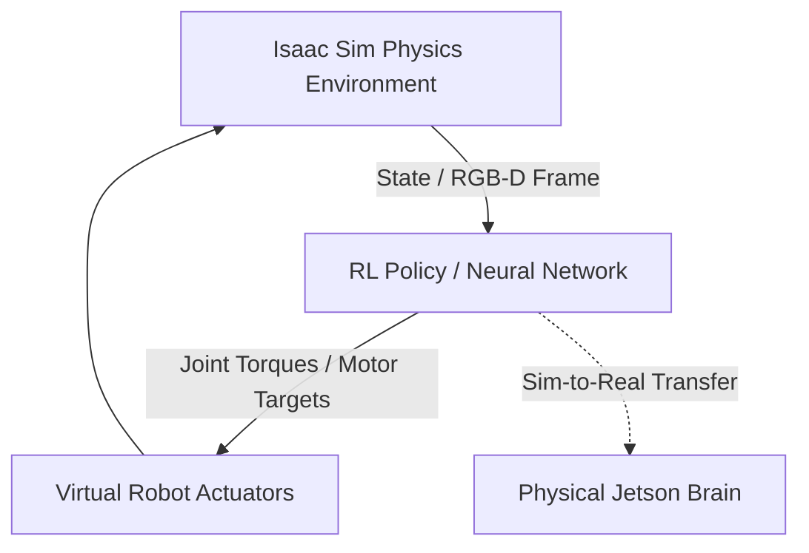
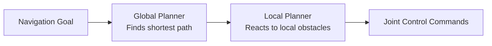

# Module 3: The AI-Robot Brain (NVIDIA Isaac™)

A humanoid robot needs an intelligent "brain" to process rich sensory data, determine its exact location, and plan paths through dynamic environments. The **NVIDIA Isaac™** platform provides hardware-accelerated tools to power this cognitive layer.

---

## 1. NVIDIA Isaac Sim: Simulation to Reality (Sim-to-Real)

**NVIDIA Isaac Sim** is a photorealistic, physics-accurate simulation environment built on NVIDIA Omniverse. It is designed to train complex robotic behaviors—such as walking (locomotion) or grasping (manipulation)—using **Reinforcement Learning (RL)**.

### Sim-to-Real Challenges & Solutions
Locomotion policies trained entirely in simulation often fail on physical robots due to differences in friction, motor lag, and terrain stiffness. To bridge this "reality gap," we use:
* **Domain Randomization:** Randomly altering physics parameters (gravity, mass, friction, sensor noise) during training. This forces the policy to be robust enough to handle the variance in the real world.
* **Domain Adaptation:** Training visual models on synthetic images that undergo random lighting and texture changes, allowing the model to perform in real environments.

---

## 2. Isaac ROS: Hardware-Accelerated Perception

Processing stereo camera video streams to construct a map in real-time is extremely expensive for edge CPUs. **Isaac ROS** leverages the GPU cores on the NVIDIA Jetson Orin to run hardware-accelerated perception pipelines.

* **VSLAM (Visual Simultaneous Localization and Mapping):** Estimates the robot's 3D pose (position and orientation) by tracking visual features across camera frames. Using Isaac ROS VSLAM, a robot can navigate reliably without GPS.
* **DNN Stereo Depth:** Uses deep neural networks on NVIDIA TensorRT to calculate highly accurate stereo depth from dual camera inputs in real-time.

---

## 3. Nav2: Bipedal Path Planning

Once the robot knows its position (via VSLAM), it uses the **Nav2** (Navigation 2) stack to calculate paths and steer joints around static or moving obstacles.

* **Costmaps:** Nav2 projects the robot’s environment onto 2D grids called costmaps. Walls and obstacles are represented as "high-cost" cells, while free space represents "zero-cost" cells.
* **Planner & Controller Server:** The planner calculates the absolute path from point A to point B, while the controller adjusts motor outputs dynamically to slide past unexpected obstructions.

---

## 4. Weekly Breakdown (Weeks 8-10)

* **Week 8 (Isaac Sim & Omniverse):** Loading USD robot assets, configuring sensors, and setting up synthetic data generation (SDG) pipelines.
* **Week 9 (Isaac ROS & VSLAM):** Integrating RealSense cameras, running VSLAM on NVIDIA Jetson, and tuning visual tracking thresholds.
* **Week 10 (Reinforcement Learning & Nav2):** Setting up Isaac Gym, training locomotion policies, configuring Nav2 costmaps, and executing path planning.
