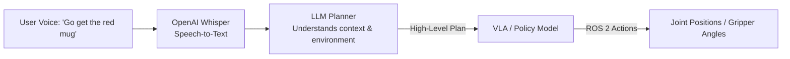

# Module 4: Humanoid Development & VLA

At the peak of humanoid robotics is the integration of physical hardware with large cognitive models. By connecting **Vision-Language-Action (VLA)** models to control loops, humanoid robots can understand open-ended natural commands, make plans, and execute physical motions.

---

## 1. Vision-Language-Action (VLA) Paradigm

Traditional robots require specific, pre-programmed code for every action. A VLA model allows the robot to parse high-level instructions directly into low-level physical control parameters.



### A. Voice-to-Action (Speech Processing)
Using speech-to-text engines like **OpenAI Whisper**, the robot converts real-time voice commands into clean text strings, ignoring background factory or home noise.

### B. Cognitive Planning via LLMs
High-level instructions (e.g., *"Clean up the spilled water"*) are too vague for a motor controller. An LLM acts as a cognitive coordinator by translating this general request into a sequence of concrete ROS 2 goals:
1. Locate a cloth or paper towel (Computer Vision).
2. Navigate to the cloth's position (Nav2).
3. Pick up the cloth (Kinematics & Grasping).
4. Navigate to the spill (Nav2).
5. Wipe the surface (Control Loop).

---

## 2. Humanoid Locomotion & Manipulation

Unlike wheeled bases, bipedal humanoid robots are inherently unstable and require active balance control.

### Kinematics and Dynamics
* **Forward Kinematics:** Computes the position of the robot's hands or feet based on its current joint angles.
* **Inverse Kinematics (IK):** Computes the exact joint angles needed to place the hand or foot at a specific 3D coordinate (e.g., reaching for a door handle).
* **Center of Mass (CoM):** Balance controllers must continuously keep the robot's CoM within its support polygon (the contact area of its feet) to prevent it from falling.

### Manipulation & Grasping
Humanoid hands use multiple joints (degrees of freedom) to perform dexterous manipulation. Force/Torque sensors in the fingers measure resistance, preventing the robot from crushing fragile objects like eggs or glassware.

---

## 3. Capstone Project: The Autonomous Humanoid

To graduate, students must implement a complete, end-to-end simulated humanoid pipeline.

```text
Voice Command -> Whisper Text -> LLM Step Planner -> Nav2 Pathing -> YOLO Object Search -> IK Gripper Grasping
```

1. **Input:** The robot receives a voice command: *"Pick up the soda can and place it on the table."*
2. **Planning:** The LLM Planner outputs a step-by-step ROS 2 action pipeline.
3. **Execution:**
   * The robot localizes and navigates to the kitchen counter.
   * A YOLO neural network identifies the soda can't coordinates.
   * Inverse Kinematics calculations adjust the arm joints to reach the can.
   * Tactile sensors trigger a secure grip.
   * The robot navigates to the table and releases the can.

---

## 4. Weekly Breakdown (Weeks 11-13)

* **Week 11 (Bipedal Balance & Walking):** Modeling humanoid links, studying ZMP (Zero Moment Point) balance, and deploying walking controllers.
* **Week 12 (Dexterous Grasping):** Joint space trajectories, inverse kinematics solvers, and contact force feedback.
* **Week 13 (VLA & Conversational AI):** Integrating speech-to-text, configuring LLM task planners, and binding them to ROS 2 action servers.
